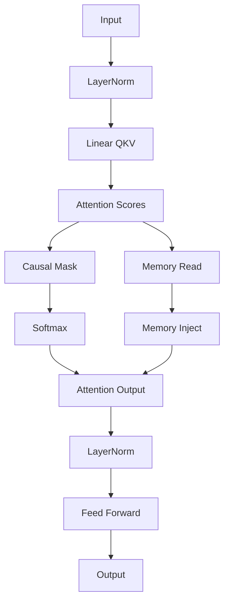

# SNN Vulkan Shader Reference

Overview of the GLSL compute shader library for Spiking Neural Networks (SNN) and Neuromorphic Transformers.

## 1. Neuron Models

| Shader | Description | State Input | Usage |
| :--- | :--- | :--- | :--- |
| `lif-neuron` | Leaky Integrate-and-Fire | `v`, `spikes` | Basic spiking unit |
| `gif-neuron` | Gated Integrate-and-Fire | `v`, `i_1`, `i_2`, `thresh` | Complex adaptive dynamics |
| `gif-prosody` | Prosody-Modulated GIF | `v`, `params` | Auditory/Speech processing |

## 2. Synaptic & Learning

| Shader | Description | Inputs | Usage |
| :--- | :--- | :--- | :--- |
| `synapsis-forward` | Linear projection (Spike $\to$ Current) | `spikes`, `weights` | Dense connections |
| `synapsis-stdp-trace` | Update eligibility traces | `spikes`, `traces` | Pre/Post-synaptic history |
| `synapsis-stdp-update` | STDP weight update | `traces`, `weights` | Unsupervised learning |
| `hebbian-learning` | Correlation-based plasticity | `pre`, `post`, `W` | Associative learning |
| `fisher-info` | Accumulate Fisher Information | `gradients` | Continual Learning (EWC) |
| `fisher-natural-gradient` | Natural Gradient Descent | `grads`, `fisher` | Optimization |

## 3. Encodings & Embeddings

| Shader | Description | Usage |
| :--- | :--- | :--- |
| `embedding-lookup` | Dense vector retrieval from token IDs | Inputs |
| `place-cell` | Gaussian place field generation | Spatial encoding |
| `time-cell` | Temporal Gaussian/Sequential fields | Temporal encoding |
| `theta-gamma-encoding` | Phase-amplitude coupling position | Positional encoding |
| `semantic-encoder` | Fuses token embeddings + Place cells | Hippocampal embedding |

## 4. Attention Mechanisms

| Shader | Description | Key Features |
| :--- | :--- | :--- |
| `attention-scores` | $Q \cdot K^T / \sqrt{d}$ | Scaled dot-product |
| `attention-mask` | Causal masking | Autoregressive masking |
| `attention-prosody-modulation` | Biases scores using prosody features | Speech-aware attention |
| `attention-output` | Weights $\cdot$ V | Weighted aggregation |
| `attention-concat-heads` | Reshape `[B, S, H, D]` $\to$ `[B, S, H*D]` | Multi-head fusion |

## 5. Feed-Forward (FFN) & Activations

| Shader | Description | Formula |
| :--- | :--- | :--- |
| `fnn-linear` | Dense Linear Layer | $y = Wx + b$ |
| `fnn-layernorm` | Layer Normalization | $\frac{x-\mu}{\sigma}\gamma + \beta$ |
| `activation-gelu` | GELU Activation | $0.5x(1 + \tanh(\dots))$ |
| `activation-softmax` | Softmax (LogSumExp stable) | $e^{x_i} / \sum e^{x_j}$ |
| `fnn-dropout` | Training regularization | Inverted dropout |

## 6. Memory & Retrieval (RAG)

| Shader | Description | Role |
| :--- | :--- | :--- |
| `memory-write` | Store Key-Value pairs | Episodic storage |
| `memory-read` | Retrieve by similarity | Episodic retrieval |
| `memory-query-pooling` | Mean-pool hidden states | Query generation |
| `memory-context-aggregate` | Weighted sum of memories | Context fusion |
| `memory-inject-gate` | Gated memory injection | RAG integration |

## 7. FAISS (Similarity Search)

| Shader | Description | Metric |
| :--- | :--- | :--- |
| `faiss-distance` | Pairwise distance matrix | L2, Cosine, IP |
| `faiss-topk` | Select K nearest neighbors | Selection sort |
| `faiss-quantize` | Vector Quantization (VQ) | Compression |
| `faiss-kmeans-update` | Centroid update step | Clustering |

## 8. Adaptive Experts (NLMS)

| Shader | Description | Algorithm |
| :--- | :--- | :--- |
| `nlms-predict` | Linear prediction | Online expert |
| `nlms-update` | Normalized LMS update | Online learning |
| `nlms-ensemble` | RMSE-weighted gating | Expert fusion |
| `domain-classifier` | Classify input domain | Routing |

## 9. Preprocessing & Whitening

| Shader | Description | Function |
| :--- | :--- | :--- |
| `whitening-transform` | Online standardization | Input normalization |
| `fft-butterfly` | Radix-2 FFT | Frequency analysis |
| `bridge-spike-to-continuous` | Rate/Phase decoding | SNN $\to$ ANN |

## 10. Pipeline Usage Example

**Hippocampal Transformer Layer:**

